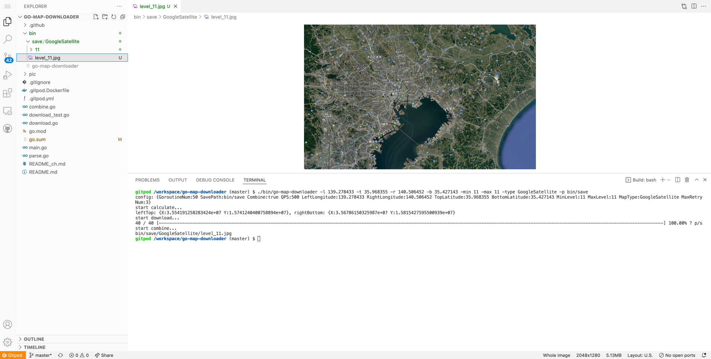
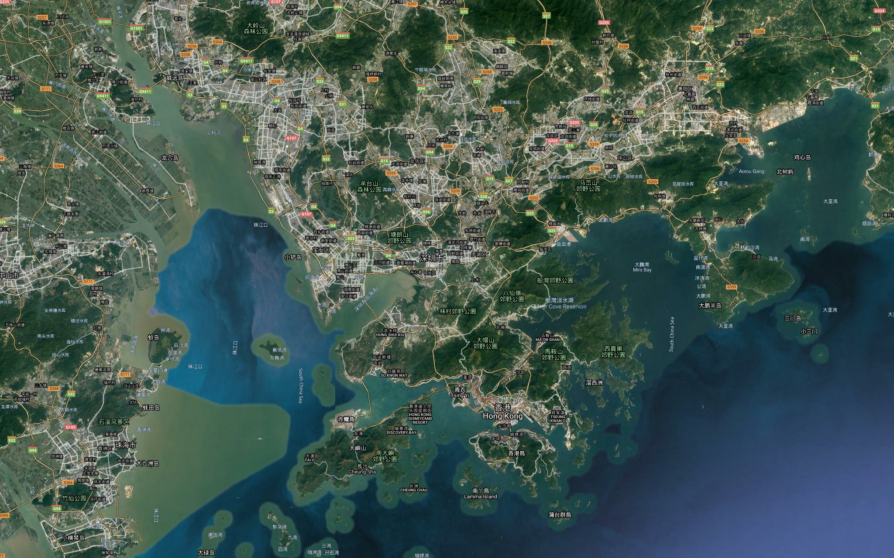
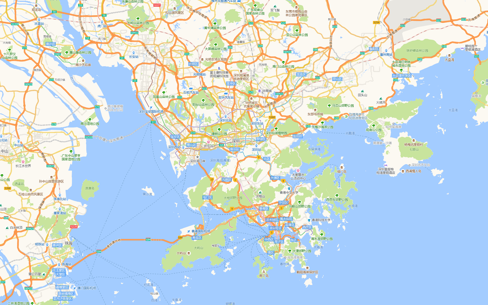

# go-map-downloader


English | [中文](README_ch.md)

Map downloader for golang. It supports multiple map type:

- google satellite
- google image
- google terrain
- amap satellite
- amap cover
- amap image

## Feature

- Download map tile picture
- Combine tile to a big map

## Install

### Gitpod (recommended)

[](https://gitpod.io/#https://github.com/Icemap/go-map-downloader)

You can open this project on Gitpod by clicking above. Gitpod is a complete cloud development environment that you can use as a remote VSCode. This allows you to not need to configure your local environment.

Because the compile command is already run, you can use the binary directly: `bin/go-map-downloader` . Try running:

```bash
./bin/go-map-downloader -l 139.278433 -t 35.968355 -r 140.506452 -b 35.427143 -min 11 -max 11 -type GoogleSatellite -p bin/save
```

The results:



### Local installation

```bash
go get -u github.com/Icemap/go-map-downloader
```

## Example

### google satellite

```bash
./go-map-downloader -l 139.278433 -t 35.968355 -r 140.506452 -b 35.427143 -min 11 -max 11 -type GoogleSatellite
```



> **Note:**
>
> You can use the `google-label` parameter to control if hide labels in Google type maps.  
>
> ```
> ./go-map-downloader -l 139.278433 -t 35.968355 -r 140.506452 -b 35.427143 -min 11 -max 11 -type GoogleSatellite -google-label=false
> ```
>
> Please notice that the parameter `google-label` will affect Google type only.

### amap image

```bash
./go-map-downloader -l 139.278433 -t 35.968355 -r 140.506452 -b 35.427143 -min 11 -max 11 -type AMapImage
```



### help

```
./go-map-downloader -h
Usage of ./go-map-downloader:
  -b float
        bottom latitude
  -c    combine same level map together (default true)
  -g int
        goroutine nums (default 50)
  -google-label
        only effect when the map type is GoogleSatellite / GoogleImage / GoogleTerrain (default true)
  -l float
        left longitude
  -max int
        map max level (default 3)
  -min int
        map min level (default 1)
  -p string
        map save path (default "/tmp")
  -q int
        query file per second number (default 500)
  -r float
        right longitude
  -retry int
        max retry num (default 3)
  -t float
        top latitude
  -type string
        map type (GoogleSatellite/GoogleImage/GoogleTerrain/AMapSatellite/AMapCover/AMapImage) (default "GoogleSatellite")
```
