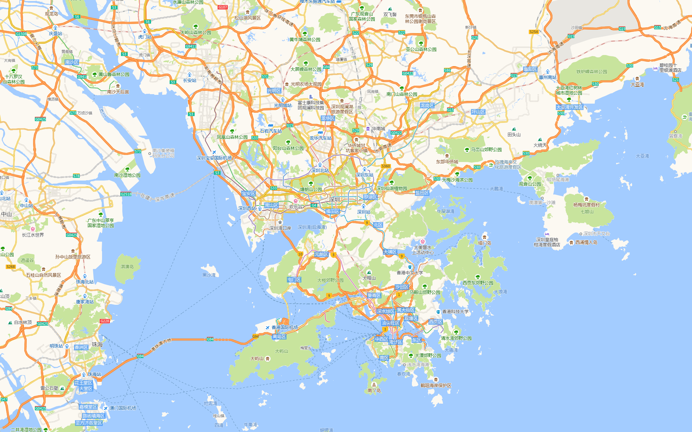

# go-map-downloader


[English](README.md) | 中文

Golang编写的地图下载器. 支持多种地图类型:

- 谷歌卫星图
- 谷歌标准地图
- 谷歌地形图
- 高德卫星图
- 高德覆盖层图
- 高德标准地图

## 功能

- 下载地图瓦片
- 拼接瓦片为大地图

## 安装

```bash
$ go get -u github.com/Icemap/go-map-downloader
```

## 🌰例子

### 谷歌卫星图
```bash
$ ./go-map-downloader -l 139.278433 -t 35.968355 -r 140.506452 -b 35.427143 -min 11 -max 11 -type GoogleSatellite
```


### 高德标准地图
```bash
$ ./go-map-downloader -l 139.278433 -t 35.968355 -r 140.506452 -b 35.427143 -min 11 -max 11 -type AMapImage
```


### 帮助
```bash
$ ./go-map-downloader -h
Usage of ./go-map-downloader:
  -b float
        bottom latitude
  -c    combine same level map together (default true)
  -g int
        goroutine nums (default 50)
  -l float
        left longitude
  -max int
        map max level (default 3)
  -min int
        map min level (default 1)
  -p string
        map save path (default "/tmp")
  -q int
        query file per second number (default 500)
  -r float
        right longitude
  -retry int
        max retry num (default 3)
  -t float
        top latitude
  -type string
        map type (GoogleSatellite/GoogleImage/GoogleTerrain/AMapSatellite/AMapCover/AMapImage) (default "GoogleSatellite")
```